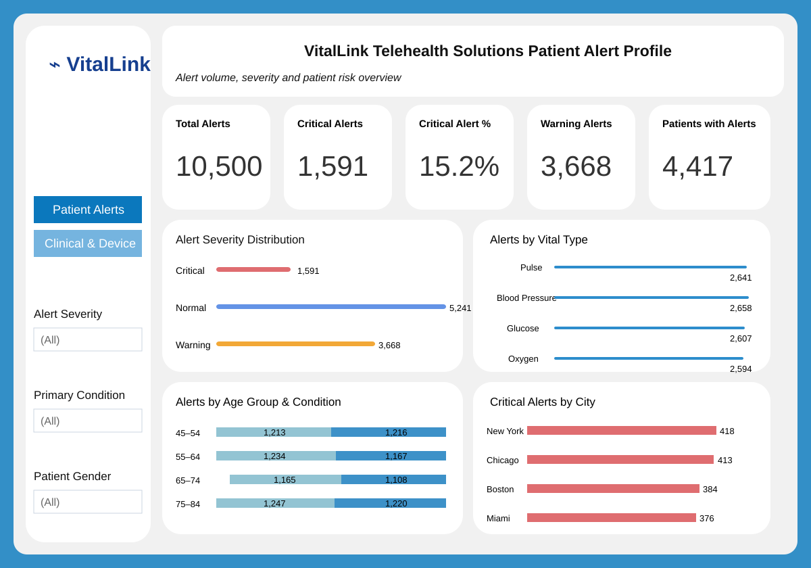
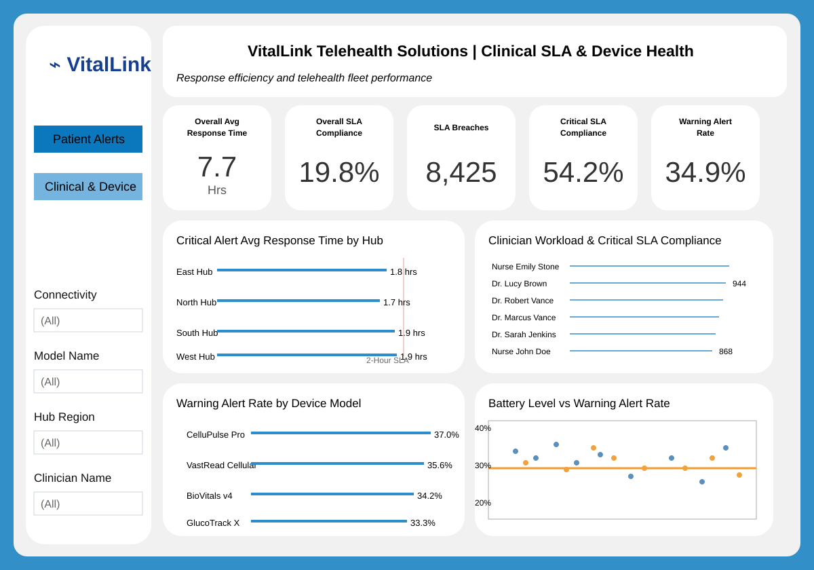

# Dashboard

The VitalLink Tableau project contains two analytical views.

## 1. Patient Alert Profile

Purpose: understand alert volume, severity and patient-risk concentration.

The dashboard covers:

- total alert workload
- Critical and Warning alert volume
- severity distribution
- alert volume by vital type
- age group and primary condition
- Critical alerts by city

## 2. Clinical SLA & Device Health

Purpose: measure operational response and test whether device health is contributing to Warning Alert volume.

The dashboard covers:

- overall average response time
- overall SLA compliance
- SLA breaches
- Critical SLA compliance
- Critical response time by hub
- clinician workload
- Warning Alert Rate by device model
- battery level vs Warning Alert Rate

